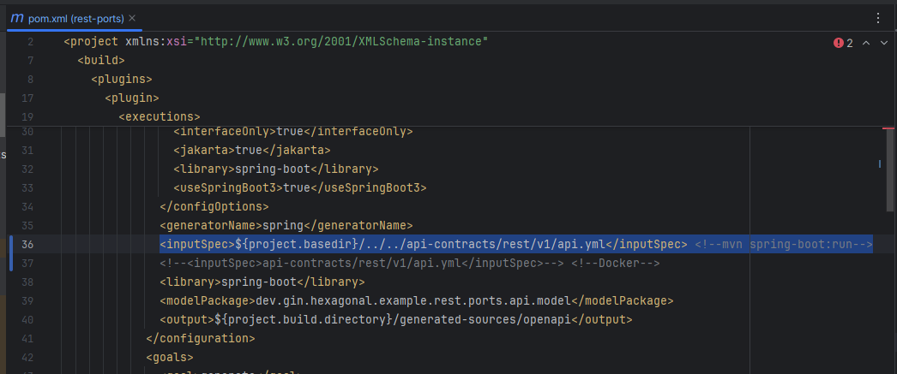
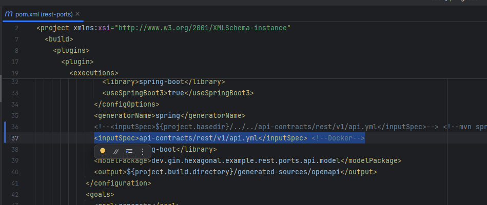
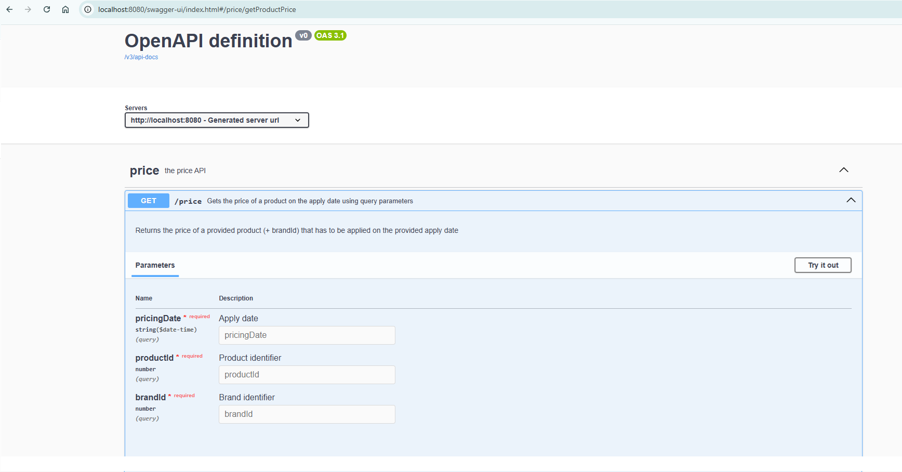
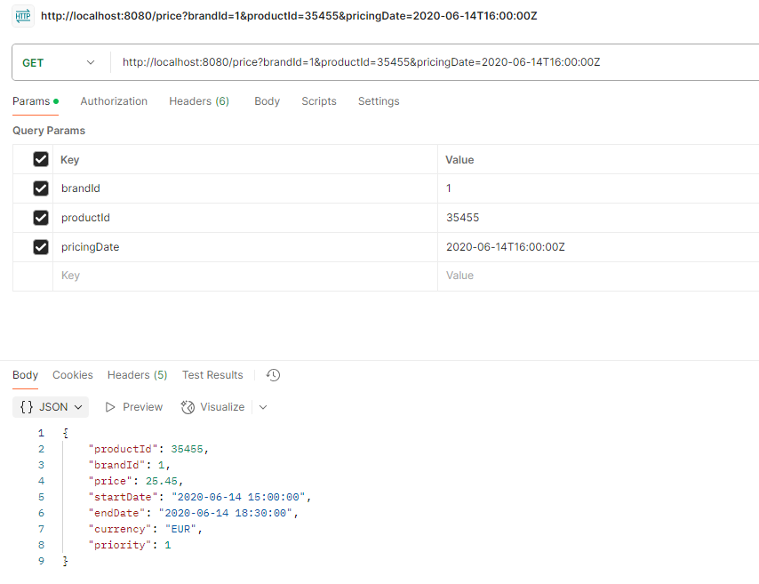
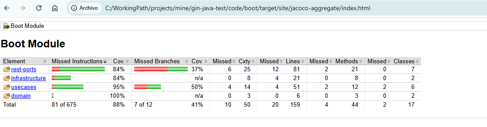

# gin-java-test

## Generate jar:

- Download project and execute in a cmd shell from project directory, the following command: mvn
  clean install

## Execute jar:

- Execute in a cmd shell from project directory:
    * (dir gin-java-test/code): mvn clean install
    * (dir gin-java-test/code/boot): mvn spring-boot:run
- 

## Docker:

- In the root path ("gin-java-test") execute:
    * docker build -t gin-hexagonal-example .
    * docker run -p 8080:8080 gin-hexagonal-example
- 
- It is required to run Redis

## Accesses

- H2:
    * http://localhost:8080/h2
    * Data:
        * url: jdbc:h2:mem:PricesJavaTest
        * username: sa
        * password:
    * Insert data: script is in src/test/resources/data/insert-prices.sql

- Swagger:
  http://localhost:8080/swagger-ui.html
  
- Test the application:
  Open a Postman (for example) and execute the following POSTs:
  
  (No additional headers required)

## Used technologies:

| Technology          | Version         | Description                                              |
|---------------------|-----------------|----------------------------------------------------------|
| **Java**            | 21              | Latest version with which I have professional experience |
| **Maven**           | 3.9.3           | Build tool and dependency manager                        |
| **Spring Boot**     | 3.4.5           | Main application framework                               |
| **Lombok**          | 1.18.30         | Reduces boilerplate (getters, constructors, etc.)        |
| **MapStruct**       | 1.6.3           | Simplifies mapping between entities and DTOs             |
| **H2 Database**     | In-memory       | Embedded database for testing purposes                   |
| **OpenAPI/Swagger** | 2.8.8/2.2.21    | Auto-generated API documentation                         |
| **Prometheus**      | Latest (Docker) | Metrics collection and monitoring                        |
| **Docker**          | 24.x            | Containerization of the application                      |
| **JUnit / Mockito** | 5.11.4 / 5.14.2 | Unit and integration testing framework                   |
| **IntelliJ IDEA**   | 2024.3.3        | IDE (Community Edition)                                  |

## Justification of decisions:

- PRICES table primary key: In the test statement, PRICE_LIST is used as the primary key field,
  which can lead to
  confusion, so I renamed it to ID.
  Additionally, I've used UUID instead of Long, due to it is a best practice in distributed
  microservices.
- PRICES table dates: I've used Instant as date object as I wanted to maintain date information with
  UTC time zone, as this application can be running in different time zones servers. So it is better
  to work with common time, and then make to transformation to system time zone in the ports in
  order to show the date in the current time zone to the users.
- @RefreshScope has been used in order to show that properties can be automatically updated in case
  we use config-server, without needed of redeploy the service.
- Integration Tests: No test containers have been added, as H2 has no test container, but it should
  be added a PostgreSQL (for example) in next steps. Here also should be place kafka containers when
  kafka is used.
  Additionally, specify that there are Repository and Cache Evict IT test, which should not be
  placed there, but I thought it was better test it. They can be removed if so.
- Cache: Basic Cache used has been added. It should be improved in Next Steps.
- Jacoco: It has been added jacoco in the project in order to verify what is the coverage. I used
  +80% for Instructions only, so more tests must be done, but if you check the "Missing" lines
  you'll see there are few additional lines to be covered (but they must be implemented), but you
  can see how I work.
  
- Query approach: At first I've chosen the way of getting all the results for Branch and product in
  the period of time and take the max priority. As it is not the best performance behaviour (almost
  in this case), then I've changed it and perform all that in the DB query.

## Proposal for improvements:

There are lots of things that could/should be done to improve this application:

- Kafka: Kafka was not used as in this context was not need, but it should be used in Next steps as
  the requirements grows.
  In this part, I must say that I would use Retries and Circuit Breakers, using Dlq and Parking lot.
  Additional implementation and configuration changes should be done/added.
  topics.
- I would use OptimisticLocking, managing OptimisticLockingFailureException, if required. For this,
  it would be needed some additional implementation and some db table modifications (version,...).
- Tests: Just mention, I would use Camouflage library in case of need to call external REST/GRPC
  endpoints.
  Moreover, I would implement a "way" of reading/load test "entities" from jpa instead of creating
  it manually.
- Observability: Observability should be added:
    * Prometheus has to be configured and also Grafana (for example).
    * Additionally, "user" metrics should be added (micrometer) should be added in case specific
      application metrics are needed.
    * Grafana should be configured in order to show specific panels and alerts (Prometheus
      configuration also required in this last point).
- Redis: Additional configuration should be added (as cache duration, etc...).

